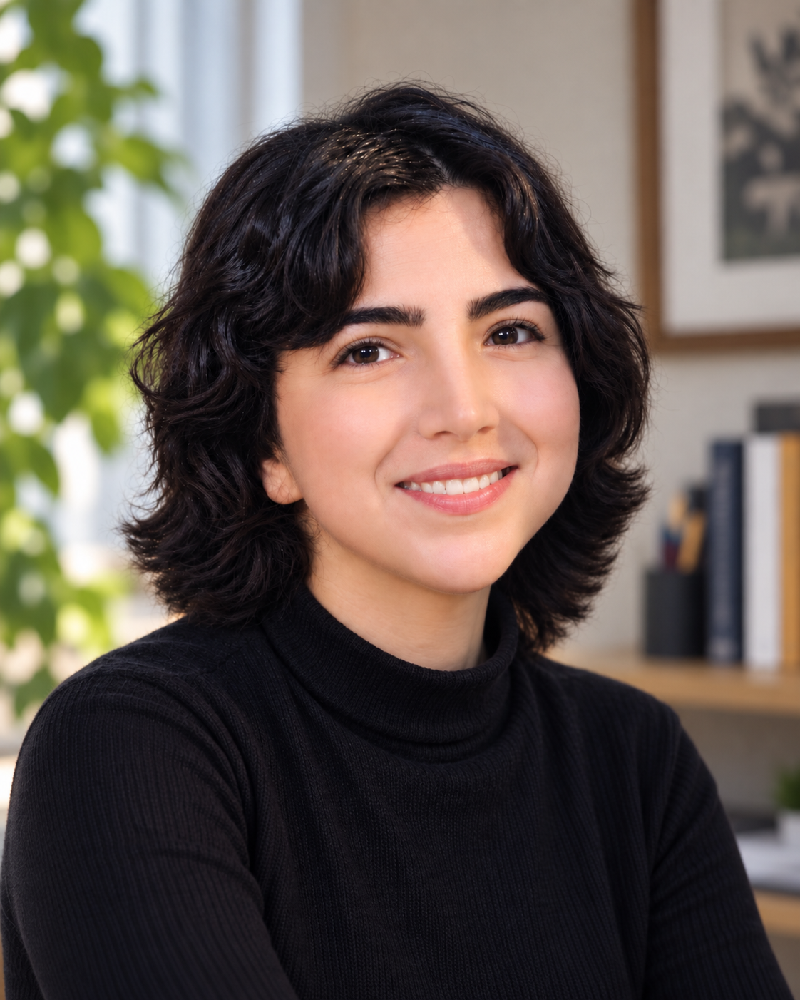

::::: {.home-hero}

:::: {.home-hero-text}

::: {.eyebrow}
AI safety · Interpretability · Reasoning
:::

# Setareh Najafi

::: {.lede}

I’m a Computer Science PhD student at UC Santa Barbara, with current research interests in AI safety, mechanistic interpretability, and language-model reasoning. My broader work has included machine unlearning for LLMs, formal methods, physics-informed neural networks, and reinforcement learning.

I earned my M.S. in Computer Science from UCSB and my B.Sc. in Computer Science from the University of Tehran.

Seeking research opportunities in AI safety and interpretability for early 2027.

:::

[GitHub](https://github.com/setarehnj) · [LinkedIn](https://www.linkedin.com/in/setareh-najafi-023870273/) · [Email](mailto:njf.setareh@gmail.com)

::::

:::: {.home-hero-image}

{.profile-photo alt="Setareh Najafi"}

::::

:::::



## Recent

::: {#recent}
:::